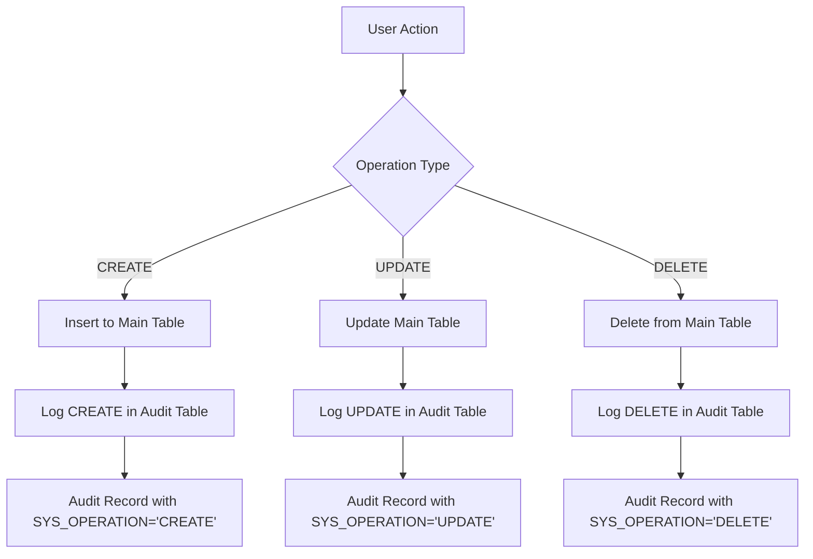

# CAPPS Database Schema Guide

This guide explains how to prepare database scripts for CAPPS collections, including data type mapping, required framework columns, and best practices.

## Schema to Database Mapping

### Collection to Table Mapping

- **`DATA_MODEL`** in `schema.json` → **Database table name**
- **`FIELDS`** in `schema.json` → **Database column names**
- Each field in `schema.json` should have a corresponding column in the database table with the same name

### Field Type to Database Type Mapping

CAPPS supports Oracle and MySQL databases. Here's the complete field type mapping:

| CAPPS Field Type | Oracle | MySQL | Description |
|------------------|---------|-------|-------------|
| `textfield` | `VARCHAR2(255)` | `VARCHAR(255)` | Text input fields |
| `checkbox` | `VARCHAR2(1)` | `VARCHAR(1)` | Checkbox values (Y/N) |
| `radio` | `VARCHAR2(50)` | `VARCHAR(50)` | Radio button selection |
| `switch` | `VARCHAR2(1)` | `VARCHAR(1)` | Switch/toggle values (Y/N) |
| `textarea` | `VARCHAR2(4000)` | `TEXT` | Multi-line text |
| `int` | `NUMBER` | `INT` | Integer numbers |
| `float` | `NUMBER` | `DECIMAL(10,2)` | Decimal numbers |
| `email_address` | `VARCHAR2(255)` | `VARCHAR(255)` | Email addresses |
| `date` | `DATE` | `DATE` | Date values |
| `time` | `VARCHAR2(8)` | `TIME` | Time values (HH:MM:SS) |
| `datetime` | `DATE` | `DATETIME` | Date and time |
| `select` | `VARCHAR2(255)` | `VARCHAR(255)` | Dropdown selections |
| `file` | `BLOB` | `LONGBLOB` | Binary file data |
| `password` | `VARCHAR2(255)` | `VARCHAR(255)` | Password fields |
| `ratings` | `NUMBER` | `TINYINT` | Rating values (1-5) |
| `rich_text_editor` | `CLOB` | `TEXT` | HTML rich text content |

### Framework Required Columns

Every CAPPS collection table **must** include these framework-level columns:

| Column Name | Oracle | MySQL | Purpose | Required |
|-------------|--------|-------|---------|----------|
| `ID` | `NUMBER` | `BIGINT AUTO_INCREMENT` | Primary key with auto-increment | ✅ Yes |
| `CREATED_BY` | `VARCHAR2(50)` | `VARCHAR(50)` | User who created the record | ✅ Yes |
| `CREATED_ON` | `DATE` | `DATETIME` | Record creation timestamp | ✅ Yes |
| `UPDATED_BY` | `VARCHAR2(50)` | `VARCHAR(50)` | User who last updated the record | ✅ Yes |
| `UPDATED_ON` | `DATE` | `DATETIME` | Last update timestamp | ✅ Yes |
| `FILE_ID` | `NUMBER` | `BIGINT` | File attachment reference (if applicable) | ⚠️ Optional |

## Complete Database Script Example

### Oracle Database Script

Here's a complete example for creating a CAPPS collection table in Oracle:

```sql
-- Create table for collection_one
CREATE TABLE "SBIL_DEV_NEW"."RSA_COLLECTION_ONE" 
(
    -- Primary key with auto-increment sequence
    "ID" NUMBER DEFAULT "SBIL_DEV_NEW"."RSA_COLLECTION_ONE_IDSEQ"."NEXTVAL", 
    
    -- Business columns (from schema.json FIELDS)
    "TEXT_FIELD" VARCHAR2(50 BYTE), 
    "CHECKBOX_FIELD" VARCHAR2(50 BYTE), 
    "RADIO_FIELD" VARCHAR2(50 BYTE), 
    "RADIO_FIELD2" VARCHAR2(50 BYTE), 
    "SWITCH_FIELD" VARCHAR2(50 BYTE), 
    "TEXTAREA_FIELD" VARCHAR2(4000 BYTE), 
    "EXPRESSION_TEXTAREA_FIELD" VARCHAR2(4000 BYTE), 
    "COMMAND_PALLATE_TEXTAREA_FIELD" VARCHAR2(4000 BYTE), 
    "INTEGER_FIELD" NUMBER, 
    "FLOAT_FIELD" NUMBER, 
    "EMAIL_FIELD" VARCHAR2(100 BYTE), 
    "DATE_FIELD" DATE, 
    "TIME_FIELD" VARCHAR2(50 BYTE), 
    "DATE_TIME_FIELD" DATE, 
    "SELECT_FIELD" VARCHAR2(50 BYTE), 
    "REMOTE_SELECT_FIELD" VARCHAR2(50 BYTE), 
    "FILE_FIELD" BLOB, 
    "PASSWORD_FIELD" VARCHAR2(255 BYTE), 
    "RATINGS_FIELD" NUMBER, 
    "RICH_TEXT_EDITOR_FIELD" VARCHAR2(4000 BYTE), 
    
    -- Framework required columns
    "CREATED_ON" DATE, 
    "CREATED_BY" VARCHAR2(20 BYTE), 
    "UPDATED_ON" DATE, 
    "UPDATED_BY" VARCHAR2(20 BYTE), 
    "FILE_ID" NUMBER
) 
SEGMENT CREATION DEFERRED 
PCTFREE 10 PCTUSED 40 INITRANS 1 MAXTRANS 255 
NOCOMPRESS LOGGING
TABLESPACE "SBIL_DEV_NEW" 
-- BLOB column configuration
LOB ("FILE_FIELD") STORE AS SECUREFILE (
    TABLESPACE "SBIL_DEV_NEW" 
    ENABLE STORAGE IN ROW 
    CHUNK 8192
    NOCACHE LOGGING  
    NOCOMPRESS  
    KEEP_DUPLICATES 
);

-- Primary key constraint
ALTER TABLE "SBIL_DEV_NEW"."RSA_COLLECTION_ONE" 
ADD CONSTRAINT "PK_RSA_COLLECTION_ONE_ID" PRIMARY KEY ("ID")
USING INDEX PCTFREE 10 INITRANS 2 MAXTRANS 255 
COMPUTE STATISTICS 
TABLESPACE "SBIL_DEV_NEW" ENABLE;

-- Auto-increment sequence
CREATE SEQUENCE "SBIL_DEV_NEW"."RSA_COLLECTION_ONE_IDSEQ" 
INCREMENT BY 1 
START WITH 1 
NOCACHE 
NOCYCLE;
```

### MySQL Database Script

```sql
-- Create table for collection_one
CREATE TABLE `rsa_collection_one` (
    -- Primary key with auto-increment
    `ID` BIGINT NOT NULL AUTO_INCREMENT,
    
    -- Business columns (from schema.json FIELDS)
    `TEXT_FIELD` VARCHAR(255),
    `CHECKBOX_FIELD` VARCHAR(1),
    `RADIO_FIELD` VARCHAR(50),
    `SWITCH_FIELD` VARCHAR(1),
    `TEXTAREA_FIELD` TEXT,
    `EXPRESSION_TEXTAREA_FIELD` TEXT,
    `COMMAND_PALLATE_TEXTAREA_FIELD` TEXT,
    `INTEGER_FIELD` INT,
    `FLOAT_FIELD` DECIMAL(10,2),
    `EMAIL_FIELD` VARCHAR(255),
    `DATE_FIELD` DATE,
    `TIME_FIELD` TIME,
    `DATE_TIME_FIELD` DATETIME,
    `SELECT_FIELD` VARCHAR(255),
    `REMOTE_SELECT_FIELD` VARCHAR(255),
    `FILE_FIELD` LONGBLOB,
    `PASSWORD_FIELD` VARCHAR(255),
    `RATINGS_FIELD` TINYINT,
    `RICH_TEXT_EDITOR_FIELD` TEXT,
    
    -- Framework required columns
    `CREATED_ON` DATETIME,
    `CREATED_BY` VARCHAR(50),
    `UPDATED_ON` DATETIME,
    `UPDATED_BY` VARCHAR(50),
    `FILE_ID` BIGINT,
    
    PRIMARY KEY (`ID`),
    INDEX `IDX_CREATED_ON` (`CREATED_ON`),
    INDEX `IDX_UPDATED_ON` (`UPDATED_ON`),
    INDEX `IDX_CREATED_BY` (`CREATED_BY`)
) ENGINE=InnoDB DEFAULT CHARSET=utf8mb4 COLLATE=utf8mb4_unicode_ci;
```

## Database Schema Best Practices

### 1. Column Naming Conventions
- Use **UPPERCASE** column names to match schema.json field names
- Use **underscores** for word separation (e.g., `TEXT_FIELD`, `CREATED_ON`)
- Keep column names descriptive but concise

### 2. Data Type Sizing
- **VARCHAR fields**: Size appropriately (50-4000 characters based on use case)
- **TEXT/TEXTAREA fields**: Use larger sizes (4000+ characters) or TEXT type
- **EMAIL fields**: Typically 100-255 characters
- **PASSWORD fields**: At least 255 characters for hashed passwords

### 3. Constraint Guidelines
- **NO NOT NULL constraints** on business columns (CAPPS handles validation)
- **NO DEFAULT values** on business columns (let CAPPS manage defaults)
- **Primary key constraint** is required on ID column
- **Foreign key constraints** can be added for referential integrity

### 4. Index Recommendations
```sql
-- Recommended indexes for better performance
CREATE INDEX IDX_COLLECTION_ONE_CREATED_ON ON RSA_COLLECTION_ONE (CREATED_ON);
CREATE INDEX IDX_COLLECTION_ONE_UPDATED_ON ON RSA_COLLECTION_ONE (UPDATED_ON);
CREATE INDEX IDX_COLLECTION_ONE_CREATED_BY ON RSA_COLLECTION_ONE (CREATED_BY);

-- Add indexes on frequently filtered fields
CREATE INDEX IDX_COLLECTION_ONE_STATUS ON RSA_COLLECTION_ONE (STATUS);
CREATE INDEX IDX_COLLECTION_ONE_TYPE ON RSA_COLLECTION_ONE (TYPE);
```

## Child Collection Relationships

For parent-child relationships, add foreign key columns:

```sql
-- Parent collection (collection_one)
CREATE TABLE RSA_COLLECTION_ONE (
    ID NUMBER PRIMARY KEY,
    -- other columns...
);

-- Child collection (collection_two) 
CREATE TABLE RSA_COLLECTION_TWO (
    ID NUMBER PRIMARY KEY,
    PARENT_ID NUMBER,  -- Foreign key to parent collection
    -- other columns...
    
    -- Foreign key constraint
    CONSTRAINT FK_COLLECTION_TWO_PARENT 
    FOREIGN KEY (PARENT_ID) REFERENCES RSA_COLLECTION_ONE(ID)
);
```

In the child collection's schema.json:
```json
{
    "PARENT_ID": {
        "fieldtype": "select",
        "linked_to": {
            "ref": "collection_one",
            "key": "ID",
            "display_name": "ID"
        }
    }
}
```

## Virtual Collections

Virtual collections don't need physical tables. They use custom SQL queries defined in the schema:

```json
{
    "DATA_MODEL": "VIRTUAL_VIEW_NAME",
    "VIRTUAL_COLLECTION": 1,
    "SQL": "SELECT ID, NAME, STATUS FROM SOME_TABLE WHERE CONDITION = 'VALUE'"
}
```

## Migration Scripts

When modifying existing collections, create migration scripts:

```sql
-- Add new column
ALTER TABLE RSA_COLLECTION_ONE ADD NEW_FIELD VARCHAR2(100);

-- Modify column size
ALTER TABLE RSA_COLLECTION_ONE MODIFY EXISTING_FIELD VARCHAR2(200);

-- Add index
CREATE INDEX IDX_COLLECTION_ONE_NEW_FIELD ON RSA_COLLECTION_ONE (NEW_FIELD);
```

## Troubleshooting Common Issues

### 1. Column Name Mismatch
**Problem**: Field works in UI but doesn't save to database
**Solution**: Ensure database column name exactly matches schema.json field name (case-sensitive)

### 2. Data Type Mismatch  
**Problem**: Data truncation or type conversion errors
**Solution**: Verify database column type matches CAPPS field type mapping

### 3. Missing Framework Columns
**Problem**: CAPPS throws errors about missing columns
**Solution**: Add all required framework columns (ID, CREATED_BY, CREATED_ON, UPDATED_BY, UPDATED_ON)

### 4. File Upload Issues
**Problem**: File uploads fail or don't store properly
**Solution**: Ensure BLOB column exists and LOB configuration is correct (Oracle)

### 5. Primary Key Issues
**Problem**: Cannot create/update records
**Solution**: Verify ID column has proper auto-increment setup (sequence in Oracle, AUTO_INCREMENT in MySQL)

## CAPPS Audit System

CAPPS framework automatically maintains audit trails for all data operations. For every collection table (DATA_MODEL), there is a corresponding audit table that logs all CREATE, UPDATE, and DELETE operations.

### Audit Table Structure

For each collection table, CAPPS creates an audit table with the same name plus `_AUDIT` suffix:

- **Main Table**: `RSA_COLLECTION_ONE`
- **Audit Table**: `RSA_COLLECTION_ONE_AUDIT`

### Audit Table Schema

The audit table contains:
1. **All original table columns** (exact copy of the main table structure)
2. **Additional audit columns** for tracking operations

#### Required Audit Columns

| Column Name | Data Type | Purpose |
|-------------|-----------|---------|
| `SYS_AUDITREASON` | `VARCHAR2(255)` / `VARCHAR(255)` | Reason for the operation (optional user input) |
| `SYS_USERID` | `VARCHAR2(50)` / `VARCHAR(50)` | User ID who performed the operation |
| `SYS_AUDITDATE` | `DATE` / `DATETIME` | Timestamp when the operation occurred |
| `SYS_OPERATION` | `VARCHAR2(10)` / `VARCHAR(10)` | Operation type: 'CREATE', 'UPDATE', 'DELETE' |
| `SYS_AUDITID` | `NUMBER` / `BIGINT` | Unique audit record identifier (Primary Key) |

### Complete Audit Table Example

#### Oracle Audit Table Script
```sql
-- Audit table for RSA_COLLECTION_ONE
CREATE TABLE "SBIL_DEV_NEW"."RSA_COLLECTION_ONE_AUDIT" 
(
    -- All original table columns (copied exactly)
    "ID" NUMBER, 
    "TEXT_FIELD" VARCHAR2(50 BYTE), 
    "CHECKBOX_FIELD" VARCHAR2(50 BYTE), 
    "RADIO_FIELD" VARCHAR2(50 BYTE), 
    "SWITCH_FIELD" VARCHAR2(50 BYTE), 
    "TEXTAREA_FIELD" VARCHAR2(4000 BYTE), 
    "EXPRESSION_TEXTAREA_FIELD" VARCHAR2(4000 BYTE), 
    "COMMAND_PALLATE_TEXTAREA_FIELD" VARCHAR2(4000 BYTE), 
    "INTEGER_FIELD" NUMBER, 
    "FLOAT_FIELD" NUMBER, 
    "EMAIL_FIELD" VARCHAR2(100 BYTE), 
    "DATE_FIELD" DATE, 
    "TIME_FIELD" VARCHAR2(50 BYTE), 
    "DATE_TIME_FIELD" DATE, 
    "SELECT_FIELD" VARCHAR2(50 BYTE), 
    "REMOTE_SELECT_FIELD" VARCHAR2(50 BYTE), 
    "FILE_FIELD" BLOB, 
    "PASSWORD_FIELD" VARCHAR2(255 BYTE), 
    "RATINGS_FIELD" NUMBER, 
    "RICH_TEXT_EDITOR_FIELD" VARCHAR2(4000 BYTE), 
    "CREATED_ON" DATE, 
    "CREATED_BY" VARCHAR2(20 BYTE), 
    "UPDATED_ON" DATE, 
    "UPDATED_BY" VARCHAR2(20 BYTE), 
    "FILE_ID" NUMBER,
    
    -- Additional audit columns
    "SYS_AUDITREASON" VARCHAR2(255 BYTE),
    "SYS_USERID" VARCHAR2(50 BYTE),
    "SYS_AUDITDATE" DATE,
    "SYS_OPERATION" VARCHAR2(10 BYTE),
    "SYS_AUDITID" NUMBER DEFAULT "SBIL_DEV_NEW"."RSA_COLLECTION_ONE_AUDIT_SEQ"."NEXTVAL"
) 
SEGMENT CREATION DEFERRED 
PCTFREE 10 PCTUSED 40 INITRANS 1 MAXTRANS 255 
NOCOMPRESS LOGGING
TABLESPACE "SBIL_DEV_NEW"
-- BLOB column configuration (if original table has BLOB fields)
LOB ("FILE_FIELD") STORE AS SECUREFILE (
    TABLESPACE "SBIL_DEV_NEW" 
    ENABLE STORAGE IN ROW 
    CHUNK 8192
    NOCACHE LOGGING  
    NOCOMPRESS  
    KEEP_DUPLICATES 
);

-- Primary key for audit table
ALTER TABLE "SBIL_DEV_NEW"."RSA_COLLECTION_ONE_AUDIT" 
ADD CONSTRAINT "PK_RSA_COLLECTION_ONE_AUDIT" PRIMARY KEY ("SYS_AUDITID")
USING INDEX PCTFREE 10 INITRANS 2 MAXTRANS 255 
COMPUTE STATISTICS 
TABLESPACE "SBIL_DEV_NEW" ENABLE;

-- Sequence for audit ID
CREATE SEQUENCE "SBIL_DEV_NEW"."RSA_COLLECTION_ONE_AUDIT_SEQ" 
INCREMENT BY 1 
START WITH 1 
NOCACHE 
NOCYCLE;

-- Indexes for better audit query performance
CREATE INDEX "IDX_COLLECTION_ONE_AUDIT_DATE" ON "RSA_COLLECTION_ONE_AUDIT" ("SYS_AUDITDATE");
CREATE INDEX "IDX_COLLECTION_ONE_AUDIT_USER" ON "RSA_COLLECTION_ONE_AUDIT" ("SYS_USERID");
CREATE INDEX "IDX_COLLECTION_ONE_AUDIT_OP" ON "RSA_COLLECTION_ONE_AUDIT" ("SYS_OPERATION");
CREATE INDEX "IDX_COLLECTION_ONE_AUDIT_ORIG_ID" ON "RSA_COLLECTION_ONE_AUDIT" ("ID");
```

#### MySQL Audit Table Script
```sql
-- Audit table for rsa_collection_one
CREATE TABLE `rsa_collection_one_audit` (
    -- All original table columns (copied exactly from main table)
    `ID` BIGINT,
    `TEXT_FIELD` VARCHAR(255),
    `CHECKBOX_FIELD` VARCHAR(1),
    `RADIO_FIELD` VARCHAR(50),
    `SWITCH_FIELD` VARCHAR(1),
    `TEXTAREA_FIELD` TEXT,
    `EXPRESSION_TEXTAREA_FIELD` TEXT,
    `COMMAND_PALLATE_TEXTAREA_FIELD` TEXT,
    `INTEGER_FIELD` INT,
    `FLOAT_FIELD` DECIMAL(10,2),
    `EMAIL_FIELD` VARCHAR(255),
    `DATE_FIELD` DATE,
    `TIME_FIELD` TIME,
    `DATE_TIME_FIELD` DATETIME,
    `SELECT_FIELD` VARCHAR(255),
    `REMOTE_SELECT_FIELD` VARCHAR(255),
    `FILE_FIELD` LONGBLOB,
    `PASSWORD_FIELD` VARCHAR(255),
    `RATINGS_FIELD` TINYINT,
    `RICH_TEXT_EDITOR_FIELD` TEXT,
    `CREATED_ON` DATETIME,
    `CREATED_BY` VARCHAR(50),
    `UPDATED_ON` DATETIME,
    `UPDATED_BY` VARCHAR(50),
    `FILE_ID` BIGINT,
    
    -- Additional audit columns
    `SYS_AUDITREASON` VARCHAR(255),
    `SYS_USERID` VARCHAR(50),
    `SYS_AUDITDATE` DATETIME,
    `SYS_OPERATION` VARCHAR(10),
    `SYS_AUDITID` BIGINT NOT NULL AUTO_INCREMENT,
    
    PRIMARY KEY (`SYS_AUDITID`),
    INDEX `IDX_AUDIT_DATE` (`SYS_AUDITDATE`),
    INDEX `IDX_AUDIT_USER` (`SYS_USERID`),
    INDEX `IDX_AUDIT_OP` (`SYS_OPERATION`),
    INDEX `IDX_AUDIT_ORIG_ID` (`ID`)
) ENGINE=InnoDB DEFAULT CHARSET=utf8mb4 COLLATE=utf8mb4_unicode_ci;
```


### Audit Operation Types

The `SYS_OPERATION` column contains one of these values:

| Operation | Description | When It's Logged |
|-----------|-------------|------------------|
| `CREATE` | Record creation | When a new record is inserted into the main table |
| `UPDATE` | Record modification | When an existing record is updated |
| `DELETE` | Record deletion | When a record is deleted from the main table |

### How CAPPS Audit Works

#### Automatic Audit Logging
CAPPS framework automatically:

1. **On CREATE**: Inserts a new audit record with all field values
2. **On UPDATE**: Logs the new values after update
3. **On DELETE**: Captures the final state before deletion

#### Audit Data Flow


### Audit Configuration

#### Framework-Level Configuration
```javascript
// In your app configuration
module.exports = {
    audit: {
        enabled: true,
        retentionDays: 365,      // Keep audit records for 1 year
        excludeFields: [          // Fields to exclude from audit
            'PASSWORD_FIELD',     // Don't audit sensitive data
            'TEMP_TOKEN'
        ],
        compressionEnabled: true, // Compress old audit records
        archiveAfterDays: 90     // Archive records older than 90 days
    }
};
```

#### Collection-Level Audit Settings
```json
{
    "DATA_MODEL": "RSA_COLLECTION_ONE",
    "AUDIT_SETTINGS": {
        "enabled": true,
        "track_changes_only": true,      // Only log actual field changes
        "required_reason": false,        // SYS_AUDITREASON is optional
        "exclude_fields": ["PASSWORD_FIELD"]
    }
}
```

### Querying Audit Data

#### Common Audit Queries

**Get all changes for a specific record:**
```sql
SELECT SYS_OPERATION, SYS_USERID, SYS_AUDITDATE, SYS_AUDITREASON,
       TEXT_FIELD, EMAIL_FIELD, STATUS
FROM RSA_COLLECTION_ONE_AUDIT 
WHERE ID = 123 
ORDER BY SYS_AUDITDATE DESC;
```

**Find who deleted a record:**
```sql
SELECT SYS_USERID, SYS_AUDITDATE, SYS_AUDITREASON, *
FROM RSA_COLLECTION_ONE_AUDIT 
WHERE ID = 123 AND SYS_OPERATION = 'DELETE'
ORDER BY SYS_AUDITDATE DESC;
```

**Track changes by user:**
```sql
SELECT ID, SYS_OPERATION, SYS_AUDITDATE, 
       TEXT_FIELD, EMAIL_FIELD
FROM RSA_COLLECTION_ONE_AUDIT 
WHERE SYS_USERID = 'john.doe' 
  AND SYS_AUDITDATE >= TRUNC(SYSDATE) - 7  -- Last 7 days
ORDER BY SYS_AUDITDATE DESC;
```

**Find all updates to a specific field:**
```sql
SELECT ID, SYS_USERID, SYS_AUDITDATE, 
       TEXT_FIELD AS OLD_VALUE,
       LAG(TEXT_FIELD) OVER (PARTITION BY ID ORDER BY SYS_AUDITDATE) AS NEW_VALUE
FROM RSA_COLLECTION_ONE_AUDIT 
WHERE SYS_OPERATION = 'UPDATE'
  AND TEXT_FIELD IS NOT NULL
ORDER BY ID, SYS_AUDITDATE;
```

### Audit Trail Integration with CAPPS UI

#### Form-Level Audit Reason
```javascript
// In form.js - capture audit reason
capps.ui.collection_one.form = {
    _onBeforeSave() {
        // Prompt for audit reason on sensitive operations
        if (current_form.STATUS === 'CANCELLED') {
            // Note: capps.ui.prompt is not available, use capps.ui.open_modal for input
        return capps.ui.open_modal({
                title: "Audit Reason Required",
                message: "Please provide reason for cancellation:",
                inputType: "textarea"
            }).then(reason => {
                // Set audit reason for this operation
                capps.setAuditReason(reason);
            });
        }
    }
};
```

#### List-Level Audit History
```javascript
// In list.js - show audit history button
capps.ui.collection_one.list = {
    buttonColumns: [
        {
            key: 'audit_history',
            label: 'History',
            icon: 'pi pi-history',
            show: (row) => true,
            handler: (row, context) => {
                capps.ui.showAuditHistory({
                    collection: 'collection_one',
                    recordId: row.ID
                });
            }
        }
    ]
};
```

### Audit Maintenance and Performance

#### Regular Maintenance Tasks

**Archive Old Audit Records:**
```sql
-- Create archive table
CREATE TABLE RSA_COLLECTION_ONE_AUDIT_ARCHIVE AS 
SELECT * FROM RSA_COLLECTION_ONE_AUDIT WHERE 1=0;

-- Move old records (older than 2 years)
INSERT INTO RSA_COLLECTION_ONE_AUDIT_ARCHIVE
SELECT * FROM RSA_COLLECTION_ONE_AUDIT 
WHERE SYS_AUDITDATE < ADD_MONTHS(SYSDATE, -24);

-- Delete archived records from main audit table
DELETE FROM RSA_COLLECTION_ONE_AUDIT 
WHERE SYS_AUDITDATE < ADD_MONTHS(SYSDATE, -24);
```

**Cleanup Temporary Audit Data:**
```sql
-- Remove audit records for test data
DELETE FROM RSA_COLLECTION_ONE_AUDIT 
WHERE SYS_USERID = 'test.user' 
  AND SYS_AUDITDATE < TRUNC(SYSDATE) - 30;
```

#### Performance Optimization

**Essential Indexes:**
```sql
-- Core audit indexes (create for every audit table)
CREATE INDEX IDX_AUDIT_DATE ON {TABLE_NAME}_AUDIT (SYS_AUDITDATE);
CREATE INDEX IDX_AUDIT_USER ON {TABLE_NAME}_AUDIT (SYS_USERID);
CREATE INDEX IDX_AUDIT_OP ON {TABLE_NAME}_AUDIT (SYS_OPERATION);
CREATE INDEX IDX_AUDIT_ORIG_ID ON {TABLE_NAME}_AUDIT (ID);

-- Composite indexes for common queries
CREATE INDEX IDX_AUDIT_ID_DATE ON {TABLE_NAME}_AUDIT (ID, SYS_AUDITDATE);
CREATE INDEX IDX_AUDIT_USER_DATE ON {TABLE_NAME}_AUDIT (SYS_USERID, SYS_AUDITDATE);
```

**Partitioning for Large Audit Tables:**
```sql
-- Oracle: Partition audit table by date
CREATE TABLE RSA_COLLECTION_ONE_AUDIT (
    -- all columns as above
) PARTITION BY RANGE (SYS_AUDITDATE) (
    PARTITION audit_2023 VALUES LESS THAN (DATE '2024-01-01'),
    PARTITION audit_2024 VALUES LESS THAN (DATE '2025-01-01'),
    PARTITION audit_future VALUES LESS THAN (MAXVALUE)
);
```

### Framework Collections Audit Tables

All framework collections also have corresponding audit tables:

- `RSA_ATTACHMENTS` → `RSA_ATTACHMENTS_AUDIT`
- `RSA_FILE_EXCEPTIONS` → `RSA_FILE_EXCEPTIONS_AUDIT`
- `RSA_FILE_INTERFACE` → `RSA_FILE_INTERFACE_AUDIT`
- `RSA_PROCESS_PROGRESS` → `RSA_PROCESS_PROGRESS_AUDIT`
- `RSA_PROCESS_PROGRESS_DETAILS` → `RSA_PROCESS_PROGRESS_DETAILS_AUDIT`
- `RSA_STATIC_MASTER` → `RSA_STATIC_MASTER_AUDIT`

### Audit Best Practices

1. **Create audit tables for every business collection**
2. **Include all original table columns plus audit columns**
3. **Set up proper indexes for performance**
4. **Implement regular archiving strategy**
5. **Monitor audit table growth and disk usage**
6. **Exclude sensitive fields from audit if required**
7. **Use partitioning for high-volume audit tables**
8. **Regular backup of audit data for compliance**

The audit system provides complete traceability of all data operations in your CAPPS application, supporting compliance, security, and operational requirements.

## Database-Specific Considerations

### Oracle Database
- **Sequences**: Required for auto-increment ID columns (`CREATE SEQUENCE table_name_seq`)
- **BLOB Storage**: Use SECUREFILE LOB storage for better performance
- **VARCHAR2**: Always use VARCHAR2 instead of VARCHAR
- **Tablespace**: Consider dedicated tablespaces for data and indexes
- **Character Set**: Use AL32UTF8 for full Unicode support
- **PL/SQL**: Can use PL/SQL for complex business logic in triggers

**Oracle Configuration:**
```sql
-- Example Oracle session configuration
ALTER SESSION SET NLS_DATE_FORMAT = 'YYYY-MM-DD HH24:MI:SS';
ALTER SESSION SET NLS_TIMESTAMP_FORMAT = 'YYYY-MM-DD HH24:MI:SS.FF3';
```

### MySQL Database  
- **AUTO_INCREMENT**: Built-in auto-increment for ID columns
- **Storage Engine**: Always use InnoDB for ACID compliance and foreign keys
- **Character Set**: Use utf8mb4 for full 4-byte Unicode support
- **Collation**: Use utf8mb4_unicode_ci for better sorting
- **Configuration**: Set proper `max_allowed_packet` for large file uploads
- **SQL Mode**: Use strict mode for data integrity

**MySQL Configuration:**
```sql
-- Example MySQL session configuration
SET sql_mode = 'STRICT_TRANS_TABLES,ERROR_FOR_DIVISION_BY_ZERO,NO_AUTO_CREATE_USER,NO_ENGINE_SUBSTITUTION';
SET time_zone = '+00:00';
```

### Performance Optimization

**Oracle:**
- Use partitioning for large tables
- Configure SGA and PGA appropriately
- Use bind variables to prevent hard parsing
- Consider result cache for frequently accessed data

**MySQL:**
- Configure InnoDB buffer pool size (70-80% of RAM)
- Use query cache for read-heavy workloads  
- Optimize `innodb_log_file_size` for write performance
- Enable slow query log for performance monitoring