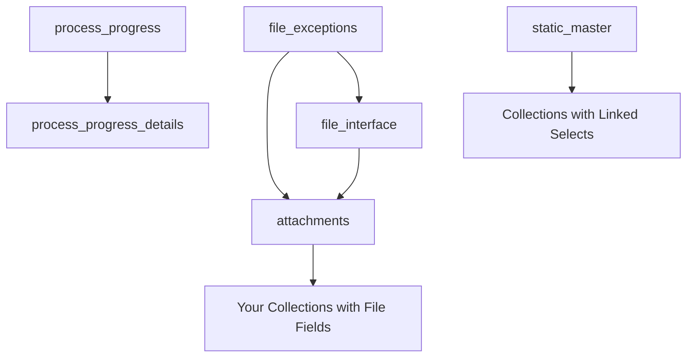

# CAPPS Framework Collections

CAPPS framework includes several built-in system collections that are essential for core framework functionality. These collections must be present in every CAPPS application and provide critical features like file handling, process tracking, and system configuration.

## Required Framework Collections

Every CAPPS application must include these framework-level collections:

### 1. `attachments` Collection

**Purpose**: Manages file attachments linked to records across all collections.

**Key Features:**
- Stores file metadata and binary data
- Links files to parent records via FILE_ID
- Handles file versioning and access control
- Supports multiple file types and size limits

**Usage in Framework:**
- Automatically used when collections have `file` field types
- Referenced through `FILE_ID` in parent collection records
- Manages file upload, storage, and retrieval
- Provides file download and preview capabilities

**Schema Structure:**
```json
{
    "DATA_MODEL": "RSA_ATTACHMENTS",
    "NAME": "Attachments",
    "ACTIONS": ["CREATE", "UPDATE", "DELETE"],
    "FIELDS": {
        "ID": {
            "fieldtype": "int",
            "iskey": 1
        },
        "FILE_NAME": {
            "fieldtype": "textfield",
            "required": 1
        },
        "FILE_DATA": {
            "fieldtype": "file"
        },
        "FILE_SIZE": {
            "fieldtype": "int"
        },
        "MIME_TYPE": {
            "fieldtype": "textfield"
        },
        "PARENT_ID": {
            "fieldtype": "int"
        },
        "PARENT_COLLECTION": {
            "fieldtype": "textfield"
        }
    }
}
```

**Integration Example:**
```javascript
// Automatic file handling in forms
const fileField = {
    "DOCUMENT": {
        "fieldtype": "file",
        "allowed_file_types": ["pdf", "doc", "docx"],
        "max_file_size_in_mb": 10
    }
};

// Framework automatically creates attachment record
// and links it via FILE_ID
```

### 2. `file_exceptions` Collection

**Purpose**: Logs and tracks file processing errors and exceptions.

**Key Features:**
- Records file upload/download failures
- Tracks validation errors (file type, size, etc.)
- Provides error details for troubleshooting
- Maintains audit trail of file operations

**Usage in Framework:**
- Automatically populated when file operations fail
- Used by system administrators for error monitoring
- Helps diagnose file handling issues
- Supports error reporting and alerts

**Common Exception Types:**
- File size exceeds limit
- Invalid file type/extension
- File corruption during upload
- Storage system errors
- Access permission issues

**Schema Structure:**
```json
{
    "DATA_MODEL": "RSA_FILE_EXCEPTIONS",
    "NAME": "File Exceptions",
    "FIELDS": {
        "ID": {
            "fieldtype": "int",
            "iskey": 1
        },
        "FILE_NAME": {
            "fieldtype": "textfield"
        },
        "ERROR_MESSAGE": {
            "fieldtype": "textarea"
        },
        "ERROR_CODE": {
            "fieldtype": "textfield"
        },
        "COLLECTION_NAME": {
            "fieldtype": "textfield"
        },
        "USER_ID": {
            "fieldtype": "textfield"
        },
        "EXCEPTION_TIME": {
            "fieldtype": "datetime"
        }
    }
}
```

### 3. `file_interface` Collection

**Purpose**: Manages bulk file import/export operations and data interfaces.

**Key Features:**
- Handles CSV/Excel file imports
- Manages data export operations
- Tracks bulk operation status
- Provides data transformation mappings

**Usage in Framework:**
- Powers bulk import functionality in list views
- Manages export operations (CSV, Excel)
- Handles data validation during imports
- Provides progress tracking for large operations

**Integration Points:**
- List view "Upload file" functionality
- Export dropdown (Download CSV/Excel)
- Bulk data operations
- Data migration tools

**Schema Structure:**
```json
{
    "DATA_MODEL": "RSA_FILE_INTERFACE",
    "NAME": "File Interface",
    "FIELDS": {
        "ID": {
            "fieldtype": "int",
            "iskey": 1
        },
        "OPERATION_TYPE": {
            "fieldtype": "select",
            "enum": ["IMPORT", "EXPORT"]
        },
        "FILE_PATH": {
            "fieldtype": "textfield"
        },
        "COLLECTION_NAME": {
            "fieldtype": "textfield"
        },
        "STATUS": {
            "fieldtype": "select",
            "enum": ["PENDING", "PROCESSING", "COMPLETED", "FAILED"]
        },
        "RECORDS_PROCESSED": {
            "fieldtype": "int"
        },
        "ERROR_DETAILS": {
            "fieldtype": "textarea"
        }
    }
}
```

### 4. `process_progress` Collection

**Purpose**: Tracks real-time progress of long-running operations and background processes.

**Key Features:**
- Real-time progress tracking
- Status updates for async operations
- Progress percentage and ETA calculation
- User notification management

**Usage in Framework:**
- Powers progress bars in UI
- Tracks event hook execution
- Monitors bulk operations
- Provides user feedback for long processes

**UI Integration:**
- Progress modals and bars
- Real-time status updates
- Cancellation support
- Error state handling

**Schema Structure:**
```json
{
    "DATA_MODEL": "RSA_PROCESS_PROGRESS",
    "NAME": "Process Progress",
    "FIELDS": {
        "ID": {
            "fieldtype": "int",
            "iskey": 1
        },
        "PROCESS_NAME": {
            "fieldtype": "textfield"
        },
        "STATUS": {
            "fieldtype": "select",
            "enum": ["STARTED", "IN_PROGRESS", "COMPLETED", "FAILED", "CANCELLED"]
        },
        "PROGRESS_PERCENTAGE": {
            "fieldtype": "int"
        },
        "CURRENT_STEP": {
            "fieldtype": "textfield"
        },
        "TOTAL_STEPS": {
            "fieldtype": "int"
        },
        "START_TIME": {
            "fieldtype": "datetime"
        },
        "END_TIME": {
            "fieldtype": "datetime"
        },
        "USER_ID": {
            "fieldtype": "textfield"
        }
    }
}
```

**JavaScript Usage:**
```javascript
// Update progress from event hooks
capps.progress.update({
    processId: 123,
    percentage: 45,
    currentStep: "Processing batch 3 of 10",
    status: "IN_PROGRESS"
});
```

### 5. `process_progress_details` Collection

**Purpose**: Stores detailed logs and step-by-step information for processes tracked in `process_progress`.

**Key Features:**
- Detailed step logs for each process
- Error messages and stack traces
- Timing information for each step
- Debug information for troubleshooting

**Usage in Framework:**
- Child collection of `process_progress`
- Provides granular process details
- Supports process debugging
- Audit trail for process execution

**Schema Structure:**
```json
{
    "DATA_MODEL": "RSA_PROCESS_PROGRESS_DETAILS",
    "NAME": "Process Progress Details",
    "FIELDS": {
        "ID": {
            "fieldtype": "int",
            "iskey": 1
        },
        "PROCESS_ID": {
            "fieldtype": "int",
            "linked_to": {
                "ref": "process_progress",
                "key": "ID"
            }
        },
        "STEP_NUMBER": {
            "fieldtype": "int"
        },
        "STEP_NAME": {
            "fieldtype": "textfield"
        },
        "STATUS": {
            "fieldtype": "select",
            "enum": ["PENDING", "RUNNING", "COMPLETED", "FAILED", "SKIPPED"]
        },
        "MESSAGE": {
            "fieldtype": "textarea"
        },
        "START_TIME": {
            "fieldtype": "datetime"
        },
        "END_TIME": {
            "fieldtype": "datetime"
        },
        "ERROR_DETAILS": {
            "fieldtype": "textarea"
        }
    }
}
```

### 6. `static_master` Collection

**Purpose**: Stores system configuration, lookup values, and static reference data.

**Key Features:**
- System-wide configuration parameters
- Lookup tables for dropdowns
- Static reference data
- Multi-level categorization support

**Usage in Framework:**
- Populates select field options
- System configuration management
- Reference data for validations
- Multi-tenant configuration

**Common Use Cases:**
- Country/State/City lookups
- Status codes and descriptions
- System parameters
- User role definitions
- Category hierarchies

**Schema Structure:**
```json
{
    "DATA_MODEL": "RSA_STATIC_MASTER",
    "NAME": "Static Master",
    "FIELDS": {
        "ID": {
            "fieldtype": "int",
            "iskey": 1
        },
        "CODE": {
            "fieldtype": "textfield",
            "unique": 1
        },
        "DESCR": {
            "fieldtype": "textfield"
        },
        "CATEGORY": {
            "fieldtype": "textfield"
        },
        "SUB_CATEGORY": {
            "fieldtype": "textfield"
        },
        "SORT_ORDER": {
            "fieldtype": "int"
        },
        "ACTIVE": {
            "fieldtype": "checkbox",
            "checked-value": "Y",
            "unchecked-value": "N"
        },
        "PARENT_ID": {
            "fieldtype": "int"
        }
    }
}
```

**Integration Example:**
```json
{
    "BRANCH_CODE": {
        "fieldtype": "select",
        "linked_to": {
            "ref": "static_master",
            "key": "CODE",
            "display_name": "DESCR",
            "filter": [
                {
                    "field": "CATEGORY",
                    "value": "BRANCHES",
                    "asgn": "eq"
                }
            ]
        }
    }
}
```

## Framework Collection Dependencies

### Collection Relationships


### Installation Order
1. **static_master** - Independent, no dependencies
2. **attachments** - Independent core collection
3. **file_exceptions** - Depends on attachments
4. **file_interface** - Depends on attachments
5. **process_progress** - Independent
6. **process_progress_details** - Depends on process_progress

## Database Setup for Framework Collections

All framework collections require the same database setup as business collections, including framework columns:

```sql
-- Example for attachments table
CREATE TABLE RSA_ATTACHMENTS (
    ID NUMBER PRIMARY KEY,
    -- Business columns specific to each framework collection
    FILE_NAME VARCHAR2(255),
    FILE_DATA BLOB,
    FILE_SIZE NUMBER,
    MIME_TYPE VARCHAR2(100),
    PARENT_ID NUMBER,
    PARENT_COLLECTION VARCHAR2(50),
    -- Required framework columns
    CREATED_ON DATE,
    CREATED_BY VARCHAR2(20),
    UPDATED_ON DATE,
    UPDATED_BY VARCHAR2(20),
    FILE_ID NUMBER
);
```

## Configuration and Customization

### Environment-Specific Settings
Framework collections can be customized per environment:

```javascript
// config/framework-collections.js
module.exports = {
    attachments: {
        maxFileSize: process.env.MAX_FILE_SIZE || 50, // MB
        allowedTypes: ['pdf', 'doc', 'docx', 'xls', 'xlsx', 'jpg', 'png']
    },
    file_interface: {
        batchSize: process.env.BATCH_SIZE || 1000,
        timeout: process.env.IMPORT_TIMEOUT || 300000 // 5 minutes
    }
};
```

### Access Control
Framework collections inherit standard CAPPS security:

```json
{
    "ACTIONS": ["CREATE", "READ", "UPDATE"], // No DELETE for audit trail
    "ACCESS_CONTROL": {
        "admin": ["CREATE", "READ", "UPDATE", "DELETE"],
        "user": ["READ"],
        "system": ["CREATE", "READ", "UPDATE"]
    }
}
```

## Monitoring and Maintenance

### Regular Maintenance Tasks
1. **Clean up old file_exceptions** - Archive/delete resolved exceptions
2. **Monitor attachments storage** - Track disk usage and cleanup orphaned files
3. **Process progress cleanup** - Remove completed process records
4. **Static master updates** - Keep reference data current

### Performance Considerations
- Index frequently queried fields
- Archive old process progress records
- Implement file storage cleanup routines
- Monitor BLOB storage growth

### Troubleshooting Common Issues

**File Upload Issues:**
- Check attachments collection for errors
- Review file_exceptions for specific error messages
- Verify file size and type restrictions

**Import/Export Problems:**
- Monitor file_interface collection for operation status
- Check process_progress for long-running operations
- Review error logs in process_progress_details

**Missing Reference Data:**
- Verify static_master has required lookup values
- Check linked_to configurations in field definitions
- Ensure proper categorization in static_master records

These framework collections form the backbone of CAPPS functionality and must be properly configured and maintained for optimal framework operation.