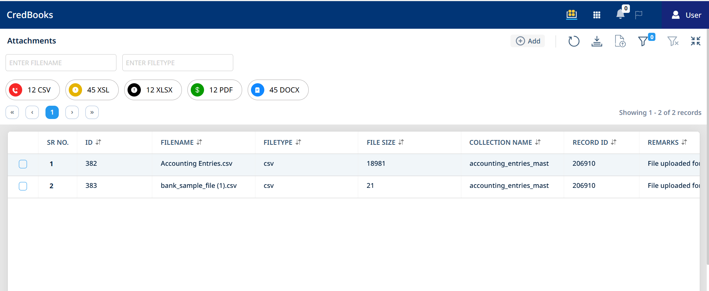
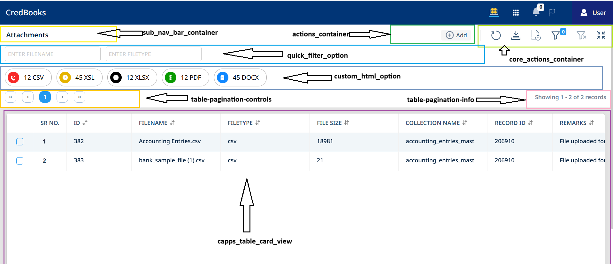
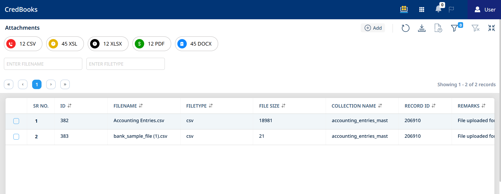
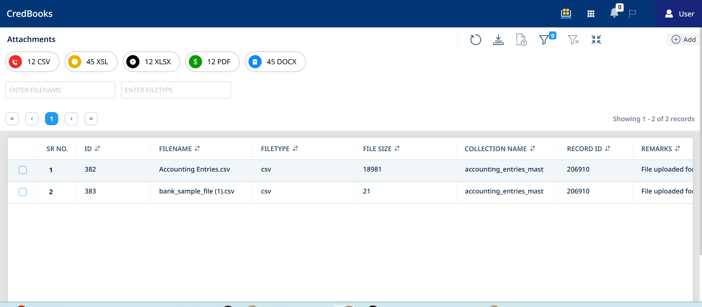

# Documentation: `.capps_collection-view-container` Layout

## 1. Overview

The `.capps_collection-view-container` SCSS rules define the primary layout structure for a collection or list view within the application. It utilizes **CSS Grid** to establish a responsive and organized arrangement of different UI sections like navigation, action buttons, filters, main content (table/cards), and pagination. **Flexbox** is also used within some of these grid areas for finer-grained alignment of their internal content.

The goal is to provide a clear and adaptable layout that can be modified to suit various design requirements.




## 2. Grid Definition

The core of the layout is defined by three main CSS Grid properties:

### 2.1. `grid-template-areas`

This property provides a visual representation of the grid's structure, naming each distinct area.



```scss
grid-template-areas:
    "sub_nav_bar_container .                     actions_container core_actions_container" // Row 1: Title and Actions
    "quick_filter_option   quick_filter_option   quick_filter_option quick_filter_option"  // Row 2: Quick Filters
    "custom_html_option    custom_html_option    custom_html_option  custom_html_option"   // Row 3: Custom HTML
    "table-pagination-controls table-pagination-controls table-pagination-controls table-pagination-info" // Row 4: Pagination
    "capps_table_card_view            capps_table_card_view            capps_table_card_view        capps_table_card_view"            // Row 5: Table view
    "router_view           router_view           router_view       router_view";          // Row 6: Router view
```

* **Structure**: This defines a grid with 6 rows and 4 columns.
* **Named Areas**:
  * `sub_nav_bar_container`: Intended for a sub-navigation bar or title area.
  * `.` (period): Represents an empty grid cell, used here as a spacer in the first row.
  * `actions_container`: For primary action buttons or controls.
  * `core_actions_container`: For core or secondary action buttons.
  * `quick_filter_option`: Spans the full width for quick filter controls.
  * `custom_html_option`: Spans the full width for dynamically injected custom HTML content.
  * `table-pagination-controls`: For pagination controls (e.g., page numbers).
  * `table-pagination-info`: For pagination information (e.g., "Showing 1-10 of 100").
  * `capps_table_card_view`: The main content area, spanning full width, for displaying tables or card views.
  * `router_view`: An area for content rendered by a router, spanning full width.
* **Spanning**: Repeating a name (e.g., `quick_filter_option`) allows that area to span across multiple grid cells.

### 2.2. `grid-template-columns`

This defines the width and behavior of the four columns in the grid.

```scss
grid-template-columns: auto minmax(1rem, auto) 1fr auto;
```

* **Column 1 (`sub_nav_bar_container`):** `auto` - Width is determined by its content.
* **Column 2 (spacer `.`):** `minmax(1rem, auto)` - Minimum width of `1rem`, can grow if needed (effectively a `1rem` spacer).
* **Column 3 (`actions_container`):** `1fr` - Takes up one fraction of the available free horizontal space, making it flexible.
* **Column 4 (`core_actions_container`):** `auto` - Width is determined by its content.

### 2.3. `grid-template-rows`

This defines the height and behavior of the six rows in the grid.

```scss
grid-template-rows: auto auto auto auto 1fr auto;
```

* **Row 1 (Title/Actions):** `auto` - Height based on content.
* **Row 2 (Quick Filters):** `auto` - Height based on content.
* **Row 3 (Custom HTML):** `auto` - Height based on content.
* **Row 4 (Pagination):** `auto` - Height based on content.
* **Row 5 (`capps_table_card_view`):** `1fr` - Takes up one fraction of the available free vertical space. This allows the main content area to expand and fill available height.
* **Row 6 (`router_view`):** `auto` - Height based on content.

The number of size definitions here **must** match the number of rows defined in `grid-template-areas`.

## 3. Grid Item Styling (Child Components)

Each direct child element within `.capps_collection-view-container` is assigned to a named grid area using the `grid-area` property.

* **`.capps__sub_nav_bar_container`**:
  * `grid-area: sub_nav_bar_container;`
  * `display: flex; align-items: center;`: Vertically centers its content.
* **`.capps__navbar_actions_container`**:
  * `grid-area: actions_container;`
  * `display: flex; align-items: center;`: Aligns its child (expected to be a navbar).
  * `overflow-x: auto;`: **Crucial** for horizontal scrolling if actions overflow.
  * `min-width: 0;`: Allows the container to shrink, enabling `overflow-x`.
  * Nested styles ensure action items within the navbar do not wrap (`flex-wrap: nowrap !important;`).
* **`.capps__navbar_core_actions_container`**:
  * `grid-area: core_actions_container;`
  * Similar flex setup for alignment and `min-width: 0;`.
  * Nested styles ensure action items do not wrap and text within them also does not wrap.
* **`.capps__table_pagination_controls`**:
  * `grid-area: table-pagination-controls;`
  * `ul.pagination { justify-content: flex-start !important; }`: Aligns pagination items to the left.
* **`.capps__table_pagination_info`**:
  * `grid-area: table-pagination-info;`
  * `display: flex; align-items: center;`: For vertical alignment of text.
* **`.capps__table_view_item`, `.capps__card_view_item`**:
  * `grid-area: capps_table_card_view;`
  * `overflow: auto;`: Allows the main content area to scroll internally if its content exceeds the allocated space.
* **`.capps__router_view_item`**:
  * `grid-area: router_view;`
  * `overflow: auto;`: For scrollable content.
* **`.capps__quick_filter_option`**:
  * `grid-area: quick_filter_option;`
  * `display: flex; flex-wrap: wrap;`: Arranges filter elements in a row, allowing wrapping.
  * `width: fit-content;`: Container only as wide as its content.
  * `> div { width: 200px; }`: Sets a fixed width for individual filter controls.
* **`.capps__custom_html`**:
  * `grid-area: custom_html_option;`
  * Similar flex setup to `quick_filter_option` for laying out its content.

## 4. Responsive Behavior (Media Queries)

The layout adapts to different screen sizes using media queries:

* **`@media (max-width: 992px)`** (Medium screens, e.g., tablets):
  * `grid-template-columns: minmax(150px, auto) minmax(1rem, auto) 1fr minmax(150px, auto);`
  * Adjusts column widths, giving the first and last columns a minimum width while the third column remains flexible.
* **`@media (max-width: 767px)`** (Small screens, e.g., mobile):
  * `grid-template-columns: minmax(120px, auto) minmax(0.5rem, auto) 1fr minmax(100px, auto);`
  * Further refines column widths for smaller viewports. The `actions_container` (in the `1fr` column) will scroll horizontally if its content overflows, due to `overflow-x: auto` set on the element itself.

## 5. Customizing the Layout

Users can modify this grid layout to suit specific design needs. Here’s how:

> **Write these styles in:** `<<APP NAME>>/public/layout/style.css`

### 5.1. Prerequisites

* A good understanding of CSS Grid properties: `grid-template-areas`, `grid-template-columns`, and `grid-template-rows`.
* Knowledge that child elements are mapped to grid areas via the `grid-area` CSS property in their respective SCSS rules.

### 5.2. Rearranging Rows

To change the vertical order of the main sections:

1. **Modify `grid-template-areas`**:
    Change the order of the quoted strings. For example, to move "Quick Filters" below "Custom HTML":

    ```diff
    --- a/src/assets/css/style.scss
    +++ b/src/assets/css/style.scss
    @@ -863,8 +863,8 @@
      // height: calc(100vh - var(--capps-header-height, 60px) - var(--capps-footer-height, 0px) - 2rem);
      grid-template-areas:
       "sub_nav_bar_container .                     actions_container core_actions_container" // Row 1: Title and Actions
    -  "quick_filter_option   quick_filter_option   quick_filter_option quick_filter_option"  // Row 2: Quick Filters
     -  "custom_html_option    custom_html_option    custom_html_option  custom_html_option"   // New Row: Custom HTML
    +  "custom_html_option    custom_html_option    custom_html_option  custom_html_option"   // Row 2: Custom HTML
    +  "quick_filter_option   quick_filter_option   quick_filter_option quick_filter_option"  // Row 3: Quick Filters
       "table-pagination-controls table-pagination-controls table-pagination-controls table-pagination-info" // Row 3: Pagination
       "capps_table_card_view            capps_table_card_view            capps_table_card_view        capps_table_card_view"            // Row 4: Table view
       "router_view           router_view           router_view       router_view";          // Row 5: Router view
    ```

2. **Verify `grid-template-rows`**:
    The number of row definitions in `grid-template-rows` must still match the number of rows in `grid-template-areas`. If the sizing characteristics of the moved rows are significantly different (e.g., you moved a `1fr` sized row), you might need to adjust the order of sizes in `grid-template-rows` accordingly. In the example above, since both were `auto`, no change to `grid-template-rows` is strictly necessary for this specific swap.



### 5.3. Rearranging Grid Areas Within a Row

To change the horizontal order of elements within a single row:

1. **Modify `grid-template-areas`**:
    Change the order of the area names within the specific row's string. For example, to swap `actions_container` and `core_actions_container` in the first row:

    ```diff
    --- a/src/assets/css/style.scss
    +++ b/src/assets/css/style.scss
    @@ -863,7 +863,7 @@
      // Example: Adjust height calculation as needed
      // height: calc(100vh - var(--capps-header-height, 60px) - var(--capps-footer-height, 0px) - 2rem);
      grid-template-areas:
    -  "sub_nav_bar_container .                     actions_container core_actions_container" // Row 1: Title and Actions
    +  "sub_nav_bar_container .                     core_actions_container actions_container" // Row 1: Title and Actions (Swapped)
       "quick_filter_option   quick_filter_option   quick_filter_option quick_filter_option"  // Row 2: Quick Filters
       "custom_html_option    custom_html_option    custom_html_option  custom_html_option"   // New Row: Custom HTML
       "table-pagination-controls table-pagination-controls table-pagination-controls table-pagination-info" // Row 3: Pagination
    ```

2. **Verify `grid-template-columns`**:
    The sizing defined in `grid-template-columns` applies to columns positionally. If `actions_container` was in the `1fr` column and `core_actions_container` in an `auto` column, swapping them in `grid-template-areas` means `core_actions_container` will now occupy the `1fr` slot and `actions_container` the `auto` slot. If this is not the desired sizing behavior, you must also update `grid-template-columns`. For instance, if you wanted `actions_container` to remain `1fr` even in its new position:

    ```scss
    // Original: auto minmax(1rem, auto) 1fr auto;
    // New if core_actions is 1fr and actions is auto:
    grid-template-columns: auto minmax(1rem, auto) auto 1fr;
    ```



### 5.4. Removing an Existing Row/Grid Area

1. **Modify `grid-template-areas`**: Remove the string corresponding to the row you want to delete.
2. **Modify `grid-template-rows`**: Remove the corresponding row size definition.
3. **Remove/Comment out HTML**: Delete or comment out the HTML element for that area.
4. **Remove/Comment out SCSS**: Delete or comment out the SCSS rule block for that area's class.

### 5.5. Important Considerations

* **Child Element `grid-area` Assignment**: If you rename a grid area in `grid-template-areas`, you **must** update the `grid-area` property in the SCSS rule for the child element that occupies that area.
* **Impact on Media Queries**: Significant layout changes might require adjustments to the `grid-template-columns` (or even `grid-template-areas`) defined within the media queries to ensure responsiveness.
* **Maintain Clarity**: Keep comments in `grid-template-areas` and `grid-template-rows` updated to reflect changes. This greatly helps in understanding the layout.
* **Thorough Testing**: After any modification, test the layout across various screen sizes and with different content volumes to ensure it behaves as expected and remains visually appealing.


### 6. Over all custom layout example

1. **Custom layout style**

```scss
  #capps__view_container_capps-guinea-pig__bill {
    grid-template-areas:
    /* Row 1: Centered block for custom_html and actions. Grid is now 4 columns. */
    "custom_html_option actions_container actions_container actions_container"
    /* Subsequent rows updated to span 4 columns */
    "quick_filter_option quick_filter_option quick_filter_option quick_filter_option"
    "table-pagination-controls table-pagination-controls table-pagination-controls table-pagination-info"
    "capps_table_card_view capps_table_card_view capps_table_card_view capps_table_card_view"
    "router_view router_view router_view router_view";
    /* Column definitions for the 4-column layout:
       Col 1: 1fr (left spacer)
       Col 2: auto (for custom_html_option, sizes to content or explicit width)
       Col 3: auto (for actions_container, sizes to content or explicit width)
       Col 4: 1fr (right spacer) */
    grid-template-columns: auto 1fr auto auto;
    grid-template-rows: auto auto auto 1fr auto;

    .card-standard-card-selector {
        display: none;
    }
    .card-standard-actions-container {
        display: none;
    }

    .capps__sub_nav_bar_container {
        display: none;
    }

    .capps__navbar_core_actions_container {
        display: none;
    }

    .capps__custom_html {
        /* Added space to top and bottom for the "row" effect */
        padding-top: 1.5rem;    /* e.g., 16px. Adjust as needed. */
        padding-bottom: 1.5rem; /* e.g., 16px. Adjust as needed. */
        padding-left: 10rem; /* e.g., 16px. Adjust as needed. */
        /* Common background is key for a unified shadow effect */
        background-color: #fff;
        /* Center content within this now wider area */
        display: flex;
        /* Align internal content to the right */
        justify-content: flex-end;
        box-shadow: -6px 4px 8px 0px rgba(0, 0, 0, 0.1);
        z-index: 2;
        border-radius: 0 0 0 30px;
    }

    .card-grid {
        grid-template-columns: repeat(auto-fill, minmax(378px, 1fr))!important;
    }
    .card-grid:not(.noscroll), .card-table {
        padding: 1.2rem 4.2rem;
        
        .card-container {
            .card {
                box-shadow: 0px 3px 10px 1px #ccc !important;
                border-radius: 18px !important;
            }
        }
    }

    .capps__navbar_actions_container {
        /* Added space to top and bottom for the "row" effect */
        padding-top: 1rem;    /* e.g., 16px. Match with .capps__custom_html */
        padding-bottom: 1rem; /* e.g., 16px. Match with .capps__custom_html */
        /* Common background is key for a unified shadow effect */
        background-color: #fff;
        /* Shadow for this row */
        box-shadow: -8px 5px 12px rgba(0, 0, 0, 0.1);
        border-radius: 0 0 30px 0;
        z-index: 1;
        display: flex; /* Helps align inner .navbar vertically if its content is shorter */
        align-items: center; /* Aligns .navbar content vertically */
        /* Align internal content (the .navbar) to the left */
        justify-content: flex-start;

        .btn_gap {
            margin-top: 0!important;
            margin-bottom: 0!important;
        }
    }

    .capps__navbar_actions_container > .navbar {
        /* Set margin-left to 0 to bring it as close as possible to the preceding element */
        margin-left: 0;
    }

    .capps__card_view_item {
        margin-top: 15px;
        background: transparent!important;
    }


    .badge-button {
        padding-left: 4px; /* Allow icon to be at the very left */
        padding-right: 16px;
        margin-left: 10px;
        padding-top: 6px;
        padding-bottom: 6px;
        border: 1px solid #9c9999cf;
        color: black;
        border-radius: 18px;
        pointer-events: none;
        display: inline-flex; /* Use flexbox for better internal alignment */
        align-items: center;  /* Vertically align icon and any text */
        gap: 8px;

        .document-pending-badge, .authorization-reject-badge, .authorize-badge, .pending-authorize-badge, .initiated-badge {
            width: 27px;
            height: 24px;
            background-repeat: no-repeat;
            background-size: contain;
            background-position: center;
            /* vertical-align: middle; /* Flexbox align-items handles this now */
            display: inline-block;
            margin-right: 6px; /* Space between icon and potential subsequent text. Adjust as needed. */
            
        }

        .document-pending-badge {
            background-image: url("./icons/Document_Pending.svg");
        }
        .authorization-reject-badge {
            background-image: url("./icons/Authorization_Reject.svg");
        }
        .authorize-badge {
            background-image: url("./icons/Authorize.svg");
        }
        .pending-authorize-badge {
            background-image: url("./icons/Pending_Authorize.svg");
        }
        .initiated-badge {
            background-image: url("./icons/Initiate.svg"); /* Existing property */
        }

        /* If an icon is the last child in the button (no text after it), remove its right margin */
        .document-pending-badge:last-child,
        .authorization-reject-badge:last-child,
        .authorize-badge:last-child,
        .pending-authorize-badge:last-child,
        .initiated-badge:last-child {
            margin-right: 0;
        }
    }
    
    li[data-action="add"] {
        button {
            display: flex;
            gap: 8px;
            background-color: #1a52b9;
            padding: 18px 40px !important;
            border-radius: 18px;
            font-weight: normal;
            svg path {
                fill: whitesmoke;
                font-weight: normal;
            }
            .action-text {
                color: whitesmoke!important;
                font-weight: normal;
            }
        }
    }
}
```

2. **Custom layout style**


---

[Go back to main page](../README.md)